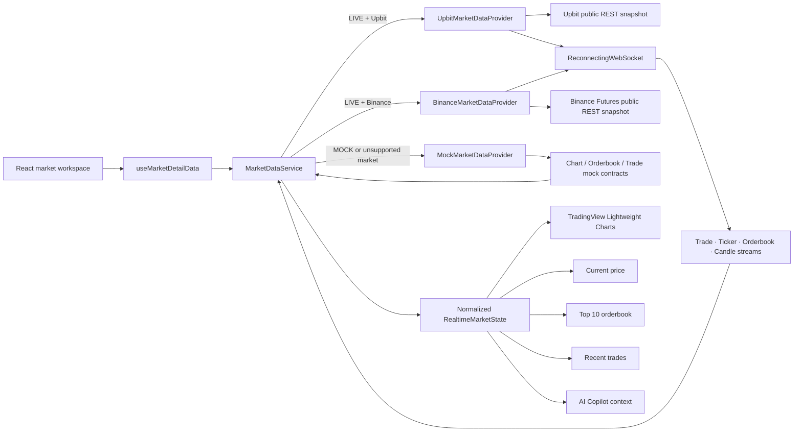

# Sprint 5 real-time market architecture

## Boundary rules

- React components never instantiate `WebSocket`, call exchange REST endpoints, or select a provider.
- `MarketDataService` is the only public facade for market snapshots and subscriptions.
- Exchange providers translate vendor payloads into InvestAI domain types.
- `ReconnectingWebSocket` owns exponential reconnect policy with a 30-second cap.
- Existing Sprint 3 provider contracts remain behind `MockMarketDataProvider` for backward compatibility.
- Adding another live venue requires a new `RealtimeMarketProvider` and one composition-root registration.
