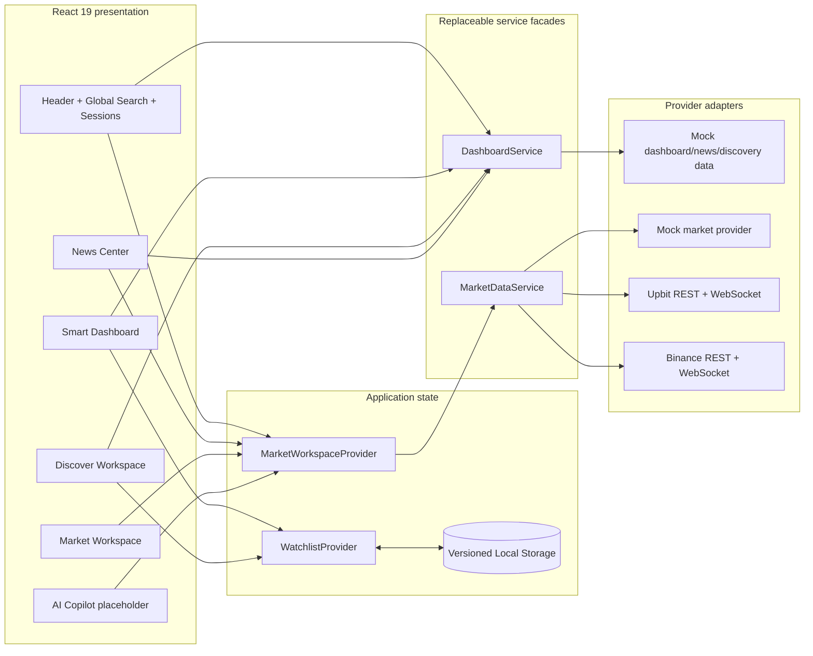

# Sprint 6 architecture

## Boundary rules

- UI components consume normalized models and never open REST or WebSocket connections.
- `DashboardService` is the single replacement point for mock overview, discovery, and news data.
- `MarketDataService` remains the Sprint 5 routing and synchronization facade for LIVE/MOCK data.
- `WatchlistProvider` owns versioned local persistence. A future authenticated repository can replace storage without changing presentation components.
- Route pages remain lazy-loaded. Shared state lives in providers; domain formatting and session calculations remain framework-independent utilities.

## Future extension points

- Add news, index, and discovery providers behind `DashboardService`.
- Add authenticated cloud synchronization behind a watchlist repository interface.
- Move exchange credentials and trading confirmation into the existing `security` boundary.
- Connect explainable model orchestration through `core_ai`; AI confidence and `Why?` remain placeholders today.
- Add backend, database, audit, and account services without allowing page components to depend on transports.
